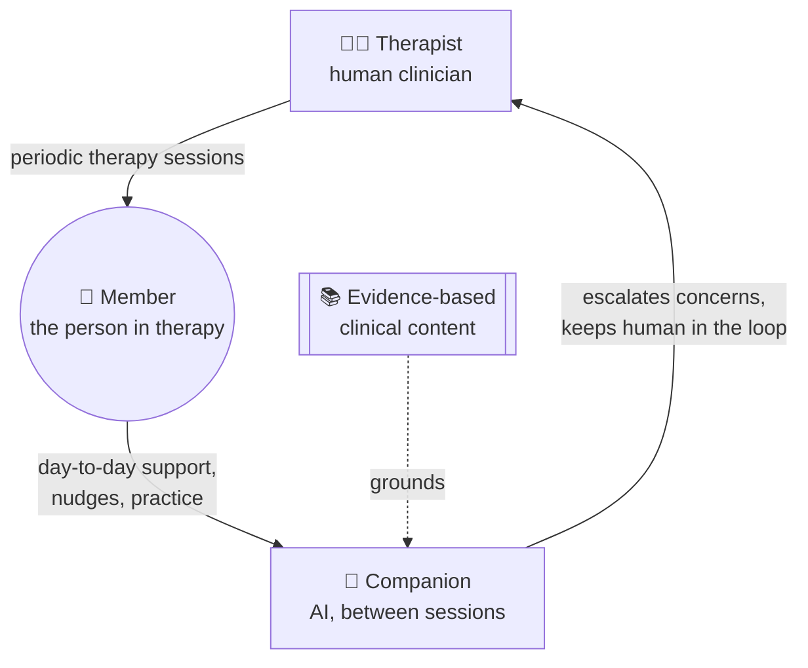

# HelloSelf · AI Engineer — Take-Home Task

**A better moment between sessions**

Thanks for taking the time to interview with us. This task is deliberately small. The
build is a starting point for a conversation, not the thing we're grading. We're far more
interested in your judgement and how you reason than in a polished artefact.

In short: find **one specific moment** in HelloSelf where AI or clever interaction could better help members
between and beyond their therapy sessions, build a small working version of something
better, and come ready to talk about it: why that moment, how you'd build it properly,
and how you'd know it was right.

---

## About HelloSelf

HelloSelf is a digital therapy service. We match members with qualified therapists for
one-to-one therapy, and we support that relationship with **Companion**, an AI that works
with both the therapist and the member. Companion isn't a standalone chatbot bolted onto
an app; it sits inside the therapeutic relationship and is trusted by both sides of it.

## The problem space

A therapy session is roughly an hour, perhaps once a week or once a fortnight. The real
work of getting better happens in the other ~167 hours: practising what was learned in
session, in real situations, until those skills hold up without help.

Today, that time is mostly unsupported, on both sides of the relationship:

- **Members** are left to remember, apply and self-correct alone.
- **Therapists** walk into the next session with little visibility of what happened in
  between. A member might exchange hundreds of messages with Companion over a fortnight.
  The therapist has minutes to catch up and wasn't there for any of it.

It's an unusual domain. The raw material is long, messy, personal free text. It's
clinically sensitive: what you surface or say, and what you don't, has real
consequences. And a human clinician always stays in the loop.

---

## Your task

### 1. Find one specific moment

Register your own member account and explore the app on **mobile** (the mobile
experience has the most to work with). Find a screen, flow or interaction that feels like
a missed opportunity to help, either for the member directly or for the therapist
supporting them.

We're deliberately not telling you where to look: spotting the right moment is part of
what we're assessing.

> **Getting the app:**
> - iOS: https://apps.apple.com/gb/app/helloself-therapy-coaching/id1515004784
> - Android: https://play.google.com/store/apps/details?id=com.helloself.mobilemember&hl=en_GB

### 2. Build one small thing

Build a small, working version of your improvement, traceable to the moment you found.
Pick whichever form suits you:

- a **web prototype** we can click through, or
- a **notebook or script** that shows the AI part doing its job on a few examples.

Mock the data, stub the backend, hard-code what you need. It doesn't need to be
full-stack, production-ready or evaluated. Don't use any real member conversations;
make up what you need. Use any language, framework or AI tooling you like.

### 3. Come ready to talk about it

You don't need to build or run any of this. Have a view we can explore together:

- **Why this moment** over the others you saw.
- **What a full version would look like**: the system behind it and where a model sits.
- **How you'd know it's right**: what "good" means, who decides, how you'd test it
  before release, and how you'd catch it going wrong after.
- **How you'd know it's helping** a member or therapist, not just working as software.

---

## How to submit

1. Click **"Use this template"** at the top of this repo to create your own copy.
2. Build in that copy, on a branch, and open a **pull request**.
3. Share the link to your repo (and PR) with @muchappreciated and @asmt3.

In the PR description, a few short paragraphs is plenty:

- **The moment you chose and why.**
- **What you built and what you deliberately left out.**
- **One thing your AI tooling got wrong**, or a suggestion you overrode, and why.

## Scope & effort

**A couple of hours at most.** Something small and sharp beats broad and half-finished.
If you're tempted to build more, write it down as something to discuss instead.

## What we care about

- **User need over instructions:** did you find your own reason for this being worth
  building?
- **Judgement on scope:** something specific and finishable.
- **Technical taste:** is what you built sound, and does any AI in it earn its place?
- **Trust and outcomes:** can you reason about whether a model output is right, and
  whether the thing actually helps a person?

## A note on using AI

We build with AI every day, and you're very welcome to use it here. We're assessing the
part AI can't do for you: which moment matters, what to prioritise, and how you'd know
the result is right. Please be ready to explain every decision as your own.

---

## The follow-up discussion

We'll then talk it through together. It's a conversation, not a presentation to be
graded. Start with a short walk-through of what you built (screen-share, run it, whatever
works), and then we'll follow wherever it leads: the product, the system, the model,
evaluation, clinical risk. Expect us to go deeper on whichever side you didn't build.
There are no trick questions; think out loud and change your mind if you want.

Any questions about the task, just reach out. Good luck, and have fun with it.
